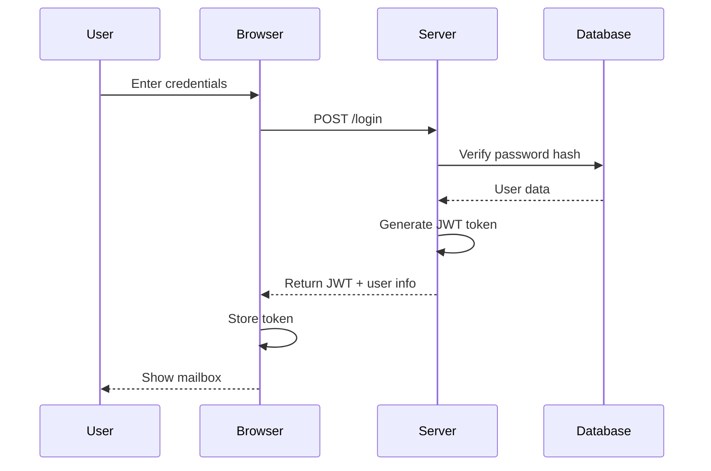
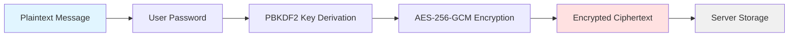
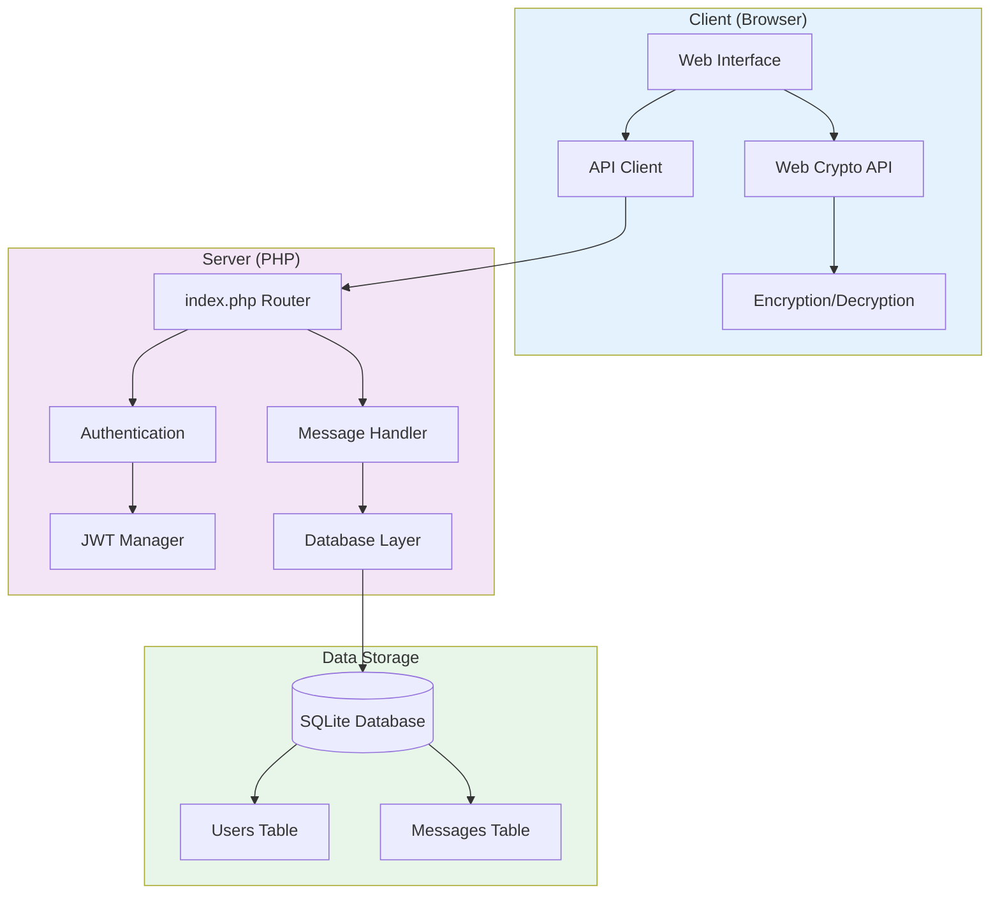

# xsukax E2EE Local Mailing System

[](https://www.gnu.org/licenses/gpl-3.0)
[](https://www.php.net/)
[](https://www.sqlite.org/)

A complete end-to-end encrypted local mailing system delivered as a single PHP file. Built with zero-knowledge architecture principles, this application ensures that your communications remain private and secure through client-side AES-256-GCM encryption.

## 🎯 Project Overview

**xsukax E2EE Local Mailing System** is a self-contained, privacy-focused email application designed for organizations and individuals who require secure internal communications without relying on third-party email providers. The entire system—including the web interface, API endpoints, and database management - is encapsulated in a single `index.php` file, making deployment remarkably simple.

### Core Capabilities

- **Zero-Knowledge Architecture**: All encryption and decryption operations occur exclusively on the client side using the Web Crypto API, ensuring the server never has access to plaintext message content
- **Self-Hosted Solution**: Complete control over your data with no external dependencies or cloud services
- **Universal Compatibility**: Automatically adapts to any domain with nginx or Apache web servers
- **Single-File Deployment**: No complex installation procedures or configuration files required
- **Encrypted Attachments**: Support for secure file sharing with the same encryption standards as messages

## 🔒 Security and Privacy Benefits

This application implements multiple layers of security to protect user communications and ensure data sovereignty:

### Client-Side Encryption

- **AES-256-GCM Encryption**: Industry-standard authenticated encryption algorithm providing both confidentiality and integrity
- **PBKDF2 Key Derivation**: Uses 100,000 iterations with SHA-256 to derive encryption keys from user passwords, protecting against brute-force attacks
- **Random Salt and IV**: Each message uses unique cryptographic salt and initialization vector values, preventing pattern analysis
- **Zero Server Knowledge**: The server stores only encrypted ciphertext and never receives or processes encryption keys

### Authentication Security

- **JWT Token-Based Authentication**: Secure, stateless session management with HMAC-SHA256 signatures
- **Bcrypt Password Hashing**: User passwords are hashed with bcrypt (cost factor 12) before storage, protecting credentials even in the event of database compromise
- **Token Expiration**: JWT tokens automatically expire after 7 days, limiting the window of opportunity for token theft
- **Rate Limiting Ready**: Architecture supports implementation of rate limiting to prevent brute-force login attempts

### Data Protection

- **SQLite with WAL Mode**: Write-Ahead Logging ensures database integrity and improves concurrent access performance
- **Parameterized Queries**: All database operations use prepared statements, eliminating SQL injection vulnerabilities
- **Input Sanitization**: User inputs are validated and sanitized to prevent XSS and injection attacks
- **HTTPS Support Detection**: Automatically detects secure connections through nginx, Apache, and reverse proxy configurations

### Privacy Advantages

- **No Third-Party Services**: All operations occur on your infrastructure without external API calls or tracking
- **Local Data Storage**: All user data remains under your control in a local SQLite database
- **No Email Headers**: Unlike traditional email, this system doesn't expose metadata like IP addresses or mail server routes
- **Secure Deletion**: Messages can be moved to trash and permanently deleted, with no recovery possible after deletion

## ✨ Features and Advantages

### Unique Selling Points

1. **True Single-File Application**: The entire system—frontend, backend, API, and database schema—exists in one PHP file, simplifying version control, deployment, and auditing

2. **Instant Deployment**: Upload `index.php` to any web server with PHP and SQLite support, and the application is immediately operational with no configuration

3. **Domain-Agnostic Design**: Automatically adapts to any domain name, generating appropriate email addresses (@yourdomain.com) without manual configuration

4. **Modern Web Interface**: Clean, responsive design built with Tailwind CSS that works seamlessly on desktop and mobile devices

5. **RESTful API Architecture**: Well-structured API endpoints enable integration with other applications or development of custom clients

6. **Attachment Encryption**: Unlike many encrypted messaging systems, this application encrypts file attachments with the same security as message content

7. **Three-Folder Organization**: Intuitive inbox, sent, and trash folder system familiar to all email users

8. **Open Source Transparency**: Complete source code visibility allows security audits and community contributions

### Key Features

- User registration with automatic email address generation
- Secure login with JWT token management
- Compose and send encrypted messages with optional attachments
- Decrypt received messages with password-based keys
- View sent message history
- Move messages to trash and permanently delete
- Message metadata (sender, recipient, timestamp, subject) stored for organization
- Attachment counter in message listings
- Real-time notifications for user actions
- Responsive design for all screen sizes

## 📋 System Requirements

- **PHP**: Version 7.4 or higher
- **Extensions**: 
  - PDO (included by default)
  - SQLite3 (included by default)
  - OpenSSL (included by default)
- **Web Server**: nginx, Apache, or any PHP-compatible web server
- **Browser**: Modern browser with Web Crypto API support (Chrome 60+, Firefox 55+, Safari 11+, Edge 79+)

## 🚀 Installation Instructions

### Basic Installation

1. **Download the Application**
   ```bash
   wget https://github.com/xsukax/xsukax-E2EE-Local-Mailing-System/raw/main/index.php
   ```

2. **Upload to Your Web Server**
   - Place `index.php` in your web root directory (e.g., `/var/www/html/mail/`)
   - Ensure the directory is writable by the web server for database creation

3. **Set Permissions**
   ```bash
   chmod 644 index.php
   chmod 755 /var/www/html/mail
   ```

4. **Access the Application**
   - Navigate to `https://yourdomain.com/mail/` in your web browser
   - The application will automatically create the SQLite database on first access

### nginx Configuration

```nginx
server {
    listen 443 ssl http2;
    server_name mail.yourdomain.com;

    ssl_certificate /path/to/certificate.crt;
    ssl_certificate_key /path/to/private.key;

    root /var/www/html/mail;
    index index.php;

    location / {
        try_files $uri $uri/ /index.php?$query_string;
    }

    location ~ \.php$ {
        fastcgi_pass unix:/var/run/php/php8.1-fpm.sock;
        fastcgi_index index.php;
        include fastcgi_params;
        fastcgi_param SCRIPT_FILENAME $document_root$fastcgi_script_name;
    }

    # Deny access to database file
    location ~ \.db$ {
        deny all;
    }
}
```

### Apache Configuration (.htaccess)

Create a `.htaccess` file in the same directory as `index.php`:

```apache
<IfModule mod_rewrite.c>
    RewriteEngine On
    RewriteCond %{REQUEST_FILENAME} !-f
    RewriteCond %{REQUEST_FILENAME} !-d
    RewriteRule ^(.*)$ index.php [QSA,L]
</IfModule>

# Deny access to database file
<Files "*.db">
    Order allow,deny
    Deny from all
</Files>

# Security headers
<IfModule mod_headers.c>
    Header set X-Content-Type-Options "nosniff"
    Header set X-Frame-Options "SAMEORIGIN"
    Header set X-XSS-Protection "1; mode=block"
</IfModule>
```

### PHP Configuration (php.ini)

Ensure the following PHP settings are configured appropriately:

```ini
# Required extensions (usually enabled by default)
extension=pdo_sqlite
extension=sqlite3
extension=openssl

# Security settings
expose_php = Off
display_errors = Off
log_errors = On
error_log = /var/log/php/error.log

# Performance and limits
max_execution_time = 30
max_input_time = 60
memory_limit = 256M
post_max_size = 50M
upload_max_filesize = 50M

# Session security (for JWT)
session.cookie_httponly = 1
session.cookie_secure = 1
session.use_strict_mode = 1
```

### Docker Deployment (Optional)

Create a `Dockerfile`:

```dockerfile
FROM php:8.1-apache

# Enable required extensions
RUN docker-php-ext-install pdo pdo_sqlite

# Copy application
COPY index.php /var/www/html/

# Set permissions
RUN chown -R www-data:www-data /var/www/html && \
    chmod 755 /var/www/html && \
    chmod 644 /var/www/html/index.php

# Enable Apache modules
RUN a2enmod rewrite headers

EXPOSE 80
```

Build and run:

```bash
docker build -t xsukax-mail .
docker run -d -p 8080:80 -v mail_data:/var/www/html xsukax-mail
```

## 📖 Usage Guide

### User Registration

1. Access the application in your web browser
2. The registration form appears by default on first visit
3. Enter a username (3-30 alphanumeric characters)
4. Create a strong password (minimum 6 characters)
5. Your email address is automatically generated as `username@yourdomain.com`
6. Click "Create Account" to register

### Authentication Flow



### Sending Encrypted Messages

1. Click the "Compose" tab in your mailbox
2. Enter the recipient's username (without @domain)
3. Write a descriptive subject line
4. **Important**: Create an encryption password and enter it in the "Encryption Key" field
5. Type your message in the content area
6. (Optional) Select files to attach using the file picker
7. Click "Send Encrypted Message"
8. **Critical**: Share the encryption password with the recipient through a secure, separate channel (e.g., Signal, phone call, in-person)

### Encryption Process



### Reading Encrypted Messages

1. Navigate to your Inbox
2. Click on a message to view details
3. Enter the encryption password (shared by the sender)
4. Click "Decrypt" to reveal the message content
5. If attachments exist, they will be decrypted and available for download

### Message Management

- **Inbox**: View all received messages
- **Sent**: Review messages you've sent to others
- **Trash**: Access deleted messages before permanent removal
- **Refresh**: Click the refresh button to check for new messages
- **Delete**: Move messages to trash, then permanently delete from trash

### System Architecture



### API Endpoints

The application provides RESTful API endpoints for programmatic access:

| Endpoint | Method | Description | Authentication |
|----------|--------|-------------|----------------|
| `/?action=info` | GET | System information | No |
| `/?action=register` | POST | Create new user | No |
| `/?action=login` | POST | Authenticate user | No |
| `/?action=send` | POST | Send encrypted message | Required |
| `/?action=messages&type={inbox\|sent\|trash}` | GET | Retrieve messages | Required |
| `/?action=message&id={id}` | GET | Get specific message | Required |
| `/?action=trash&id={id}` | POST | Move to trash | Required |
| `/?action=delete&id={id}` | DELETE | Permanently delete | Required |

### API Authentication

Include the JWT token in the Authorization header:

```bash
curl -X GET "https://yourdomain.com/mail/?action=messages&type=inbox" \
  -H "Authorization: Bearer YOUR_JWT_TOKEN"
```

## 🛡️ Security Best Practices

### For Administrators

1. **Enable HTTPS**: Always run the application over HTTPS to protect authentication tokens and prevent man-in-the-middle attacks
2. **Regular Updates**: Keep PHP and your web server updated to the latest stable versions
3. **File Permissions**: Ensure the database file is not web-accessible (use .htaccess or nginx configuration)
4. **Backup Strategy**: Regularly backup the SQLite database to prevent data loss
5. **Monitor Logs**: Review error logs for suspicious activity or attempted attacks
6. **Firewall Rules**: Restrict access to the application using firewall rules if it's for internal use only

### For Users

1. **Strong Passwords**: Use unique, complex passwords for your account and encryption keys
2. **Key Management**: Never share encryption passwords through the same system; use secure out-of-band channels
3. **Regular Cleanup**: Permanently delete sensitive messages from trash when no longer needed
4. **Device Security**: Ensure devices used to access the system are protected with screen locks and antivirus software
5. **Browser Security**: Keep your browser updated and avoid browser extensions that could compromise security
6. **Password Managers**: Consider using a password manager to generate and store strong encryption keys

## 🔧 Troubleshooting

### Database Permission Errors

If you encounter "unable to open database file" errors:

```bash
# Ensure the directory is writable
chmod 755 /path/to/application/directory
chown www-data:www-data /path/to/application/directory
```

### HTTPS Detection Issues

If the application doesn't detect HTTPS correctly behind a reverse proxy, ensure your proxy sets the appropriate headers:

```nginx
proxy_set_header X-Forwarded-Proto $scheme;
proxy_set_header X-Forwarded-SSL on;
```

### Decryption Failures

- Verify you're using the exact password provided by the sender
- Check that the message wasn't corrupted during transmission
- Ensure your browser supports the Web Crypto API

### Performance Optimization

For high-traffic deployments, consider:

- Using PHP OPcache for improved performance
- Implementing a reverse proxy cache (nginx, Varnish)
- Running PHP-FPM with appropriate worker processes
- Optimizing SQLite with appropriate PRAGMA settings (already configured)

## 📊 Database Schema

```sql
-- Users table
CREATE TABLE users (
    id INTEGER PRIMARY KEY AUTOINCREMENT,
    username TEXT NOT NULL,
    domain TEXT NOT NULL,
    email TEXT UNIQUE NOT NULL,
    password_hash TEXT NOT NULL,
    created_at DATETIME DEFAULT CURRENT_TIMESTAMP,
    UNIQUE(username, domain)
);

-- Messages table
CREATE TABLE messages (
    id INTEGER PRIMARY KEY AUTOINCREMENT,
    from_user TEXT NOT NULL,
    to_user TEXT NOT NULL,
    subject TEXT NOT NULL,
    encrypted_content TEXT NOT NULL,
    encrypted_attachments TEXT,
    is_deleted INTEGER DEFAULT 0,
    created_at DATETIME DEFAULT CURRENT_TIMESTAMP,
    FOREIGN KEY (from_user) REFERENCES users(email),
    FOREIGN KEY (to_user) REFERENCES users(email)
);
```

## 🤝 Contributing

Contributions are welcome! Please feel free to submit pull requests, report bugs, or suggest features through the GitHub issue tracker.

### Development Guidelines

- Maintain the single-file architecture principle
- Follow PHP PSR-12 coding standards
- Ensure all security features remain intact
- Test changes across multiple PHP versions
- Document any new features or API endpoints

## 📄 License

This project is licensed under the GNU General Public License v3.0.

## 🔗 Links

- **GitHub Repository**: https://github.com/xsukax/xsukax-E2EE-Local-Mailing-System
- **Author**: xsukax
- **Report Issues**: https://github.com/xsukax/xsukax-E2EE-Local-Mailing-System/issues

## ⚠️ Disclaimer

This software is provided "as is" without warranty of any kind. While every effort has been made to ensure security and privacy, users should conduct their own security audits before deploying in production environments. The author is not responsible for any data loss, security breaches, or other issues arising from the use of this software.

---

**Built with 🔒 by xsukax | Emphasizing Privacy, Security, and Simplicity**
